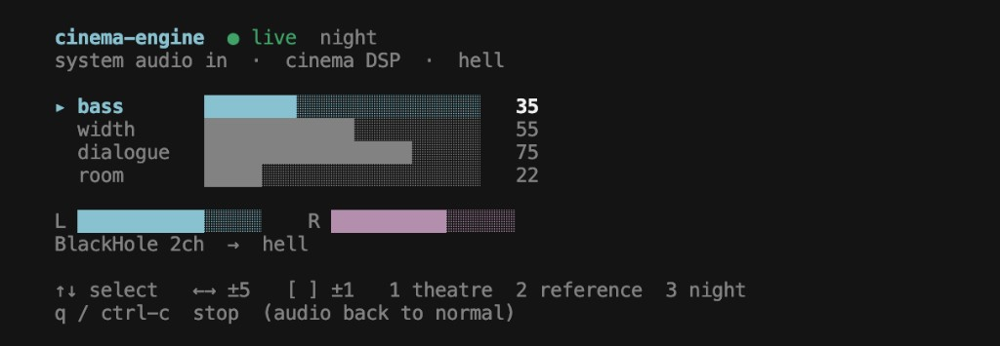

# cinema-engine

<p align="center">
  Cinema sound for Stremio (or any other Mac audio output) — on your AirPods — from the terminal.<br>
  <strong>MIT licensed.</strong> Free to use, copy, modify, and sell.
</p>

<p align="center">
  <a href="LICENSE"></a>
  
  
  
  
  
</p>

## What this is

**Stremio** (and any other Mac audio output: Safari, IINA, Music, a browser) just sends stereo to your headphones. **cinema-engine** sits in the middle and adds theatre-style sound: more bass, a wider image, voices that stay clear, a little room, and a “in front of you” spatial effect.

There is no app window. You run it in Terminal, play Stremio like usual, and listen on AirPods or speakers. When you quit, Mac sound goes back to normal.

<p align="center">
  
</p>

## Prerequisites

- macOS 13 or later
- Your Mac password once (to install the BlackHole audio driver)
- Terminal (or iTerm)
- Click **Allow** if macOS asks for Microphone access (that is for BlackHole, not your hardware mic)
- Optional: [Homebrew](https://brew.sh)

Xcode Command Line Tools are installed automatically if `swift` is missing (one GUI prompt).

## How it works

On start, cinema-engine sends **all Mac audio output** (Stremio and everything else) into BlackHole, a virtual speaker. It reads that, processes it, and plays the result on your real headphones. On quit, the old output comes back.

1. Play Stremio (or any other app with sound).
2. That audio output goes into BlackHole.
3. cinema-engine adds cinema processing (EQ, width, HRTF, room, bass, limiter).
4. You hear it on AirPods or speakers.

## Install

```bash
git clone https://github.com/jotx19/cinema-engine.git
cd cinema-engine
./install.sh
cinema-engine
```

That builds the tool, puts `cinema-engine` on your PATH (`~/.local/bin`), and can install BlackHole.

Build only:

```bash
swift build
.build/debug/cinema-engine start
```

## Use it

1. Run `cinema-engine` (same as `start` or `dev`).
2. Click **Allow** if macOS asks for Microphone.
3. Play Stremio (or anything else).
4. Mix with the keys below. Press **q** when you are done.

| Key | What it does |
| --- | --- |
| ↑ ↓ | Pick bass, width, dialogue, or room |
| ← → | Change that knob by 5 |
| `[` `]` | Change that knob by 1 |
| `1` `2` `3` | Theatre / reference / night presets |
| `q` or Ctrl+C | Stop and put Mac audio back to normal |

## Commands

Install BlackHole if needed and remember your headphones:

```bash
cinema-engine setup
```

Show every input and output the Mac can see:

```bash
cinema-engine list-devices
```

Start the live mixer (Stremio / any audio output → cinema sound → AirPods). These three do the same thing:

```bash
cinema-engine
cinema-engine start
cinema-engine dev
```

Start options (headphones, skip HRTF, or a plain status line):

```bash
cinema-engine start --output "AirPods Pro" --preset theatre
cinema-engine start --no-hrtf
cinema-engine start --plain
```

Set a knob (0–100) or a preset:

```bash
cinema-engine set bass 70
cinema-engine set width 80
cinema-engine set dialogue 60
cinema-engine set room 40
cinema-engine set preset night
```

Check the mix, or quit and restore normal audio:

```bash
cinema-engine status
cinema-engine stop
```

## Config

Saved at `~/.cinema-engine/config.json`. If cinema-engine is already running, edits apply in about 100 ms.

```json
{
  "preset": "theatre",
  "bass": 70,
  "width": 80,
  "dialogue": 60,
  "room": 40,
  "input_device": "auto",
  "output_device": "auto"
}
```

Presets: `theatre`, `reference`, `night`.

## Extra: HRTF files

For a more realistic “front of the room” effect, put MIT KEMAR (or similar) WAVs in `hrtf-data/`:

- `front_left.wav` and `front_right.wav`, or
- `H10e000a.wav` (10° up, looking forward)

If those files are missing, a built-in short impulse is used. The KEMAR dataset is not included in this repo. See `hrtf-data/README.md`.

Delay is meant to stay under about 40 ms so picture and sound stay together.

## License

[MIT](LICENSE) for this whole project: use, copy, modify, merge, publish, distribute, sublicense, and sell. Keep the copyright notice.

